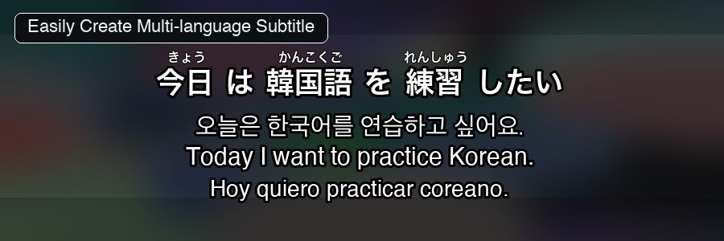
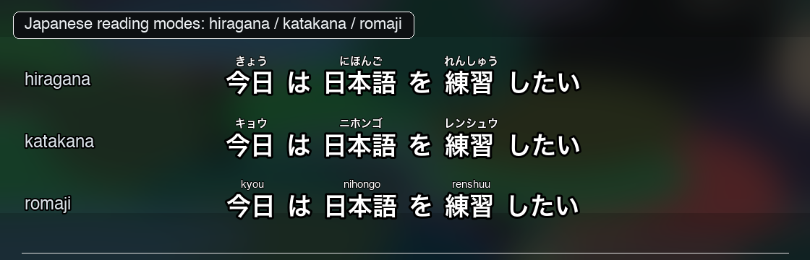
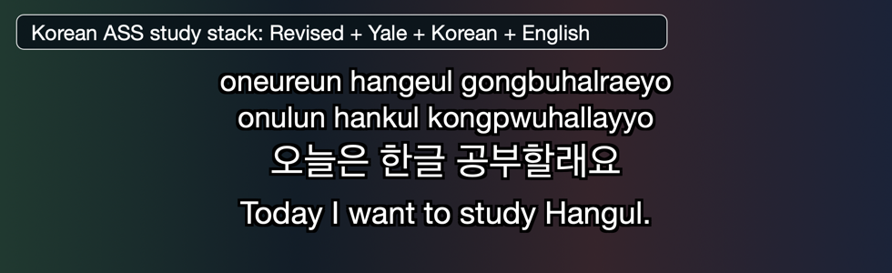
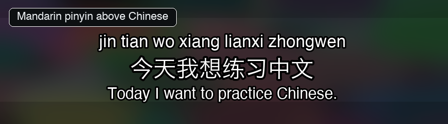
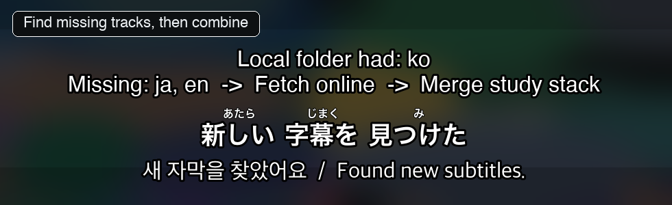

# GetSubtitle

Study movies, anime, dramas, and sitcoms with better subtitles:
multi-language stacks, pronunciation guides, cleaned captions, and missing-track recovery in one synced file.

Built for immersion learners who want subtitles that match how they actually study:
Japanese + English, Korean + romanization, Mandarin + pinyin, Cantonese + jyutping,
or whole Plex/Jellyfin folders prepared for repeated watching.


*Japanese WebVTT in asbplayer: hiragana ruby above kanji, full-sentence
romaji as a normal subtitle line, and English support in one synced cue.*

## Why Learners Use It

- **Watch with two, three, or four subtitles at once** — stack target-language subtitles with native-language support.
- **Add reading aids** — Japanese furigana/katakana ruby, romaji, Korean romanization, Mandarin pinyin, and Cantonese jyutping.
- **Fill missing language tracks** — search subtitle sources, open manual search tabs, or translate with DeepL, Ollama, or Argos.
- **Clean messy captions** — remove broadcast noise, flatten cues, convert legacy `.smi`, and make subtitles easier to sentence mine.
- **Prepare a media library** — scan Plex/Jellyfin folders, download or translate missing tracks, and merge per episode.
- **Plan browser-streaming study workflows** — use Netflix/Crunchyroll metadata to build safer subtitle searches and asbplayer-ready outputs.
- **Learn the CLI naturally** — the wizard builds the command for you, then shows exactly what it generated.

## Study Examples

### Japanese Anime



Download Japanese subtitles, add furigana or romaji, and combine them with English
into one study-friendly file.

### Korean Drama



Stack Korean, Revised Romanization or Yale romanization, and English so you can
follow sound, spelling, and meaning together.

### Mandarin Or Cantonese



Render pinyin or jyutping above Chinese subtitles and combine them with a support language.

### Missing Tracks And Library Cleanup



When a language is missing, GetSubtitle can search community sources, suggest manual searches,
or fill the gap with machine translation.

## Install In 30 Seconds

**macOS / Linux:**

```sh
curl -fsSL https://raw.githubusercontent.com/fpenguin/getsubtitle/main/setup.sh -o setup.sh
sh setup.sh
```

**Windows PowerShell:**

```powershell
Invoke-WebRequest https://raw.githubusercontent.com/fpenguin/getsubtitle/main/setup.ps1 -OutFile setup.ps1
.\setup.ps1
```

The installer creates an isolated Python environment, asks which reading-aid
backends you need, adds a `getsubtitle` shim to your `PATH`, and offers to run
first-time setup.

More install options: [docs/install.md](docs/install.md).

## First Run

```sh
getsubtitle setup     # optional first-time profile: what you watch, what you study
getsubtitle -i        # guided workflow builder
```

The wizard asks for a source, languages, reading aids, and output choices.
At the end, it shows the exact CLI command and can save the workflow for reuse.

```text
What would you like to do?
  1) Fetch      Download subtitles from a URL or title
  2) Translate  Fill missing languages with AI
  3) Modify     Clean up cues, add reading aids
  4) Merge      Create one multi-language subtitle file
  5) Rename     Batch rename subtitle files
```

No flags to memorize on day one; the wizard teaches the command as you go.

## Quick CLI Examples

```sh
# Movie by URL: Totoro, Japanese + English
getsubtitle "https://www.themoviedb.org/movie/8392" -l ja,en

# Series with Japanese furigana for browser/asbplayer study
getsubtitle "https://www.imdb.com/title/tt6150576/" \
    -s 1 -e all \
    -l ja,ko \
    --reading ja:hiragana \
    --format vtt

# Existing folder: merge Japanese + English subtitles
getsubtitle merge ~/Downloads/Show -l ja,en
```

More examples: [docs/examples.md](docs/examples.md).

## What It Can Do

- Fetch subtitles from movie, TV, anime, and streaming/catalog URLs.
- Work from local folders, video files, or subtitle files.
- Use streaming page metadata to identify titles, episodes, and better search aliases.
- Add reading aids for Japanese, Korean, Mandarin, and Cantonese.
- Merge 2-4 subtitle tracks into one synced file.
- Translate missing subtitles with local or online engines.
- Save reusable TOML workflows.
- Batch rename subtitle files with previews and copy-by-default safety.
- Run health checks before you get stuck mid-workflow.

## More Documentation

- [Getting started](docs/getting-started.md)
- [Examples](docs/examples.md)
- [Reading aids and formats](docs/reading-aids.md)
- [Saved workflows and pipeline form](docs/workflows.md)
- [API keys and providers](docs/api-keys.md)
- [Supported sources](docs/sources.md)
- [Netflix Helper design](NetflixHelper.md)
- [Install options](docs/install.md)
- [Troubleshooting](docs/troubleshooting.md)

## Responsible Use

GetSubtitle searches public community databases such as Jimaku and Wyzie.
It does **not** bypass DRM, account login, or region locks. Do not redistribute
downloaded subtitles in violation of their original license.

For local video files, `getsubtitle fetch PATH` checks embedded text subtitle
tracks and sidecar files first, then searches online only for missing
languages.

## License

MIT. See [LICENSE](LICENSE).
