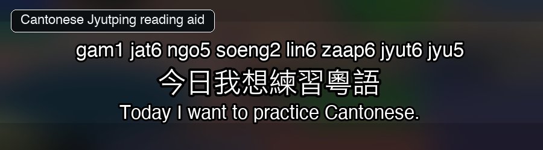
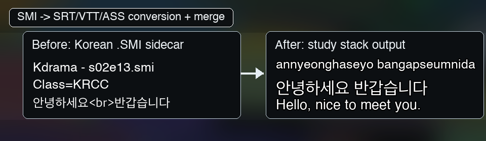

# GetSubtitle

Turn movies, anime, dramas, and sitcoms into multi-language subtitles for
language learning: dual subtitles, triple subtitles, quadruple subtitles,
reading aids, and translations in one synced file.

Built for anime, drama, and sitcom immersion learners. Output works in VLC, mpv, Plex, and asbplayer.


*Japanese WebVTT in asbplayer: hiragana ruby above kanji, full-sentence
romaji as a normal subtitle line, and English support in one synced cue.*

## Why Learners Use It

- **Watch with two, three, or four subtitles at once** — dual subtitles,
  triple subtitles, or a full multi-subtitle study file.
- **Add reading aids**: Japanese furigana/katakana ruby, full-sentence
  Japanese romaji, Korean Revised Romanization, and Mandarin pinyin.
- **Fill missing subtitles** with DeepL, Ollama, or Argos when the language
  you need is unavailable.
- **Clean messy captions** by removing broadcast noise and flattening cues for
  easier reading and sentence mining.
- **Prepare a media library** by scanning Plex/Jellyfin folders, converting legacy subtitles, downloading or translating missing tracks, and merging per episode.
- **No CLI flags to memorize** — `getsubtitle -i` builds your command in 4-7 questions and saves it as a reusable workflow.

## What you can build

| If you want to…                        | GetSubtitle…                                                                | Example                                                                          |
|----------------------------------------|-----------------------------------------------------------------------------|----------------------------------------------------------------------------------|
| Learn **Japanese** from anime          | downloads `ja`, adds furigana ruby or full-sentence romaji, combines it with your native language |       |
| Learn **Korean** with romanization       | fetches `ko`, generates Revised + Yale romanization, combines with English |  |
| Learn **Mandarin** with pinyin         | renders `nǐ hǎo` pinyin above hanzi in ASS                                  |             |
| Learn **Cantonese** with jyutping      | renders jyutping numbered tones above traditional Chinese                   |       |
| Fill **missing** language tracks       | translates with DeepL / Ollama / Argos, or opens community-search tabs      |  |
| Clean a **Plex / Jellyfin** library    | converts `.smi`, strips broadcast noise, merges per episode                 |                  |

## Install in 30 seconds

**macOS / Linux:**

```sh
curl -fsSL https://raw.githubusercontent.com/fpenguin/getsubtitle/main/setup.sh -o setup.sh
sh setup.sh
```

**Windows PowerShell:**

```powershell
Invoke-WebRequest https://raw.githubusercontent.com/fpenguin/getsubtitle/main/setup.ps1 -OutFile setup.ps1
.\setup.ps1
```

The installer creates an isolated Python environment, asks which
reading-aid backends you need (Japanese / Korean / Mandarin /
Cantonese / all), adds a `getsubtitle` shim to your `PATH`, and offers
to run first-time setup. See [§ Install — other paths](#install--other-paths)
for `pipx`, dev checkouts, and Windows execution-policy notes.

## How it works (3 steps)

1. **Fetch** — download subtitles from a streaming/catalog URL, scan a
   local folder, or both.
2. **Modify** — clean broadcast noise, add reading aids (furigana,
   pinyin, Hangul romanization), convert legacy `.smi`.
3. **Merge** — stack 2-4 language tracks into one synced study file.

The wizard runs all three by default; the CLI lets you pick any subset
(e.g. drop a folder of `.srt` files and just merge them).

## Run the wizard (recommended for first-timers)

```sh
getsubtitle setup     # one-time onboarding (optional)
getsubtitle -i        # guided workflow: 4-7 questions, then Run
```

`setup` is an optional one-time onboarding: it asks what you watch and
what you're learning, recommends the right providers and reading-aid
extras, and saves a profile that pre-fills the wizard. You can skip it
and go straight to `-i`.

`-i` asks what you want to do (fetch / translate / modify / merge),
which source, which languages, and whether you want reading aids.
Everything else (display order, cleanup, format, output folder) is
smart-defaulted and surfaced in a "Smart defaults filled in for you"
banner before the action menu so you can revise via "Edit a single
answer". You get **Run**, **Save the workflow as TOML**, **Edit**,
**Restart**, or **Quit**.

The wizard probes your environment first (pykakasi, Ollama, API keys)
so you don't get stuck mid-run, and offers to open the output folder
when it's done.

## CLI Examples

Once you've run the wizard a few times, the CLI is faster:

```sh
# Easy: a movie, by URL — Totoro, Japanese + English
getsubtitle "https://www.themoviedb.org/movie/8392" -l ja,en

# Medium: a series with furigana for asbplayer/browser ruby
# Season 1, every episode; Japanese + Korean stack; WebVTT for ruby rendering.
getsubtitle "https://www.imdb.com/title/tt6150576/" \
    -s 1 -e all \
    -l ja,ko \
    --reading ja:hiragana \
    --format vtt

# Hard: Friends S4E3-5, fill Spanish from French, then merge
getsubtitle "https://www.themoviedb.org/tv/1668-friends" -s 4 -e 3-5 -l fr,en,es
getsubtitle translate ~/Downloads/GetSubtitle/Friends -s 4 -e 3-5 -l es \
    --engine deepl --mt-source es:fr
getsubtitle merge ~/Downloads/GetSubtitle/Friends -s 4 -e 3-5 -l fr,en,es
```

For machine translation, `--mt-source "es:fr|en"` reads as "make
Spanish from French first, English as fallback". Ollama users can
pin a per-pair model: `--mt-model-pair ja:ko=qwen3:4b`.

When Japanese, Korean, or Chinese subtitles are missing, fetch prints community
search suggestions and can open the likely sources in your browser.
Toggle with `--manual-search off|on-missing|always`.

`-e all` on **non-anime TV** needs a TMDB key — set one once with
`getsubtitle --set-key tmdb`, or pass an explicit range like `-e 1-22`.

## Reading aids

Phonetic guides and learner reading rows for the original script.
Japanese hiragana/katakana can render as true ruby in WebVTT; Japanese
romaji is a normal full-sentence subtitle line. Other languages render
as above-the-line ASS or parenthetical SRT/SMI.


*Same kanji line, three formats: SRT (parenthetical), VTT (ruby above
in asbplayer), ASS (above-the-line for VLC/mpv).*

| Language          | Modes                          | Install                                          |
|-------------------|--------------------------------|--------------------------------------------------|
| Japanese (`ja`)   | `hiragana`, `katakana`, `romaji` | `pip install -e ".[furigana]"`                 |
| Korean (`ko`)     | `revised`, `yale`              | `pip install -e ".[romanization-ko]"`            |
| Mandarin (`zh`)   | `marks`, `numbers`, `letters`  | `pip install -e ".[romanization-zh]"`            |
| Cantonese (`yue`) | `numbers` (jyutping), `marks`  | `pip install -e ".[romanization-yue]"`           |
| Thai / Arabic / Hindi / Russian | Royal Thai / ALA-LC / IAST / ISO-9 | Wired through; backends land per ROADMAP |

**Format recommendations:**

| Use case                                  | Format | Notes                                               |
|-------------------------------------------|--------|-----------------------------------------------------|
| Japanese hiragana/katakana ruby in asbplayer / browser | `vtt`  | Enable asbplayer `Subtitle HTML = Render` for ruby. |
| Japanese full-sentence romaji             | `vtt`, `srt`, or `ass` | Normal subtitle-size row, not tiny ruby text. |
| Korean romanization above Hangul          | `ass`  | Most reliable in VLC / mpv / IINA.                  |
| Mandarin pinyin or Cantonese jyutping     | `ass`  | Same — ASS handles readings above characters best.  |
| Maximum player compatibility (no ruby)    | `srt`  | Parenthetical 漢字（かんじ） form; works anywhere.    |

VTT ruby is valid markup, but player support is uneven — VLC tends to
flatten ruby. For local playback of reading aids, use ASS. For
asbplayer / browser study, use VTT.

Specify on the CLI:

```sh
--reading ja:hiragana,ko:revised,zh:marks,yue:numbers
```

Or in TOML:

```toml
[modify]
reading = "ja:hiragana,ko:revised,zh:marks,yue:numbers"
```

## Multi-variant merge

Stack the original alongside its reading-aid variants:

```sh
getsubtitle merge FOLDER -l ja,ja-hiragana,en            # kanji + hiragana ruby + English
getsubtitle merge FOLDER -l ja,ja-hiragana,ja-romaji,en  # + full-sentence romaji
getsubtitle merge FOLDER -l ko,ko-revised,en             # 한글 + Revised + English
getsubtitle merge FOLDER -l zh,zh-marks,en               # 漢字 + pinyin + English
getsubtitle merge FOLDER -l yue,yue-numbers,en           # 廣東話 + jyutping + English
```

Output filenames collapse same-base tokens — you get
`Show.S01E01.ja-hiragana-romaji-en.srt`, not the redundant
`ja-ja-hiragana-ja-romaji-en` variant.

Generate variants and stack them in one call:

```sh
getsubtitle "URL" \
    --modify --reading ja:hiragana,ja:romaji \
    --merge -l ja,ja-hiragana,ja-romaji,en
```

Merged outputs include a short GetSubtitle credit/disclaimer cue at the
beginning and end. Use `--no-watermark` or `[merge] watermark = false`
to omit it for private/test files.

## Pipeline form (chain verbs in one call)

```sh
# Whole-library pass: fetch + translate + clean + merge
getsubtitle --fetch /Plex/Anime --subdirectory \
    --translate ollama \
    --modify --strip-cc-noise --single-line \
    --merge -l ja,en --format vtt

# URL → study deck into a specific output folder
getsubtitle --fetch "https://www.imdb.com/title/tt28299608/" -s 1 -e all \
    --translate deepl \
    --merge -l ja,en --format vtt \
    --output ~/Downloads/GetSubtitle/StudyDeck
```

`--subdirectory` on any PATH-based verb walks each immediate subfolder
and runs the verb per show. See `getsubtitle --help pipeline` for the
full schema.

## Save workflows as TOML

Run the wizard once, save the answers, re-run later with one flag:

```sh
getsubtitle --config simpsons-s1-en-fr.toml
getsubtitle --config plex-movies-fill-merge.toml

# CLI flags override the saved file:
getsubtitle --source /Plex/Anime --config plex-movies-fill-merge.toml
```

Two example configs ship in this repo:

- [`simpsons-s1-en-fr.toml`](simpsons-s1-en-fr.toml) — URL: download
  Simpsons S1 in English + French.
- [`plex-movies-fill-merge.toml`](plex-movies-fill-merge.toml) — PATH:
  scan `/Plex/Movies`, fetch JP/KO/EN/ES, fill MT gaps, merge in-place.

Per-user defaults live in `user_settings.toml`:

```sh
getsubtitle config --init     # write a commented template
getsubtitle config --show     # show the effective merged config
```

Layered priority (low → high):
**built-in defaults** < **user_settings.toml** < **--config FILE.toml** < **CLI flags**

## API keys & health

**API keys** — set once, stored in macOS Keychain or env vars:

```sh
getsubtitle --set-key            # interactive: pick a provider
getsubtitle --set-key jimaku     # Japanese anime (Jimaku)
getsubtitle --set-key wyzie      # movies / TV (Wyzie)
getsubtitle --set-key subdl      # SubDL fallback when Wyzie misses
getsubtitle --set-key deepl      # DeepL AI translation (free 500K chars/month)
getsubtitle --set-key tmdb       # title matching + `-e all` for live-action TV
```

If Keychain isn't available, set `JIMAKU_API_KEY`, `WYZIE_API_KEY`,
`SUBDL_API_KEY`, `DEEPL_API_KEY`, `TMDB_API_KEY` in your shell.

**Health check** — `getsubtitle doctor` reports missing Python deps,
API keys, ffmpeg/ffprobe, and Ollama before you get stuck mid-run.

**asbplayer ruby** — open asbplayer settings, `Misc > Subtitles >
Subtitle HTML = Render`, then use `--format vtt`. For local playback
with reading aids, prefer ASS; VTT ruby support varies by player.

## Machine translation engines

| Engine            | Local?  | Setup                                      | Quality |
|-------------------|---------|--------------------------------------------|---------|
| `argos` (default) | yes     | `pip install argostranslate`               | gist    |
| `ollama`          | yes     | Ollama daemon + a model (auto-pulled)      | good    |
| `deepl`           | online  | `--set-key deepl` (free 500K chars/month)  | best    |

Per-pair model selection lives in `[translate.ollama_models]` in
`user_settings.toml`. Engine spec accepts `ollama:qwen3:8b` colon-form
to pin a model.

## Supported URLs

- **Streaming:** Crunchyroll · Netflix · Hulu · Max (HBO) · Disney+ · Apple TV+ · Paramount+ · Peacock · Prime Video
- **Catalog:** IMDb · TMDB · AniList · MyAnimeList · TheTVDB · Letterboxd · Rotten Tomatoes · Trakt
- **Bridges:** AniList ↔ IMDb / TMDB / TVDB (Anime-IDs + Wikidata) · Netflix work ID → IMDb / TMDB (Wikidata P1874)

For non-anime TV, `-e all` expansion needs a TMDB key.

## Install — other paths

### pipx

If you already use `pipx`:

```sh
pipx install "getsubtitle[furigana,romanization-ko,romanization-zh,romanization-yue] @ git+https://github.com/fpenguin/getsubtitle.git"
```

On Windows: `py -m pip install --user pipx && py -m pipx ensurepath` first.

### Developer checkout

```sh
git clone https://github.com/fpenguin/getsubtitle.git
cd getsubtitle
./setup.sh                 # macOS/Linux — must run from the repo root
.\setup.ps1                # Windows — same
```

Creates an editable venv at `./.venv`. Activate each session with
`source .venv/bin/activate` (or `.\.venv\Scripts\Activate.ps1`).

### Optional dependencies (manual)

```sh
pip install -e ".[furigana]"         # Japanese (pykakasi)
pip install -e ".[romanization-ko]"  # Korean (g2pk + korean-romanizer)
pip install -e ".[romanization-zh]"  # Mandarin (pypinyin)
pip install -e ".[romanization-yue]" # Cantonese (pycantonese)
pip install -e .                     # bare install (no reading aids)
```

On Windows, prefix with `py -m `.

### PowerShell execution policy

If PowerShell blocks `.\setup.ps1`:

```powershell
Set-ExecutionPolicy -Scope Process -ExecutionPolicy Bypass
.\setup.ps1
```

### PyPI

`pip install getsubtitle` does **not** install this tool — the name
on PyPI is held by an older unrelated project. Use the GitHub
installer or the `pipx ... @ git+...` form above.

## Common commands

Each verb has its own focused `--help`:

```sh
getsubtitle --help               # overview
getsubtitle --help doctor        # health check
getsubtitle --help fetch         # URL or PATH download
getsubtitle --help translate     # AI translation
getsubtitle --help modify        # cleanup, SAMI→SRT, MKV extraction, reading aids
getsubtitle --help merge         # stack languages
getsubtitle --help reading       # reading-aid spec (ja/ko/zh/yue)
getsubtitle --help interactive   # the -i wizard
getsubtitle --help config        # user_settings.toml defaults
getsubtitle --help keys          # API key setup
getsubtitle --help advanced      # troubleshooting, experimental flags
```

## Responsible use

GetSubtitle searches public community databases (Jimaku, Wyzie,
optionally Subdivx and Addic7ed). It does **not** bypass DRM, account
login, or region locks. Don't redistribute downloaded subtitles in
violation of their original license.

For local MKV files, GetSubtitle can extract embedded text subtitle
tracks you already have and use them as translation/merge sources.

## License

MIT. See [LICENSE](LICENSE).
