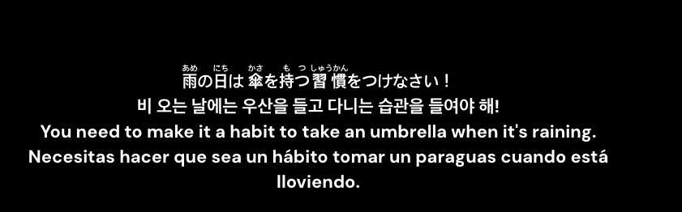

# GetSubtitle

```text
   ______     __  _____       __    __  _ __  __
  / ____/__  / /_/ ___/__  __/ /_  / /_(_) /_/ /__
 / / __/ _ \/ __/\__ \/ / / / __ \/ __/ / __/ / _ \
/ /_/ /  __/ /_ ___/ / /_/ / /_/ / /_/ / /_/ /  __/
\____/\___/\__//____/\__,_/_.___/\__/_/\__/_/\___/
```


A cross-platform Python CLI for **language-learning subtitle workflows**.

Built for people who watch foreign-language shows or movies and want predictable, scriptable subtitle prep: download in multiple languages, stack them into one timed file, and optionally fill the gaps with machine translation. Designed around Japanese learning but works for any language pair the underlying providers cover.

Primary output is **SRT**. That is the format used for downloads, machine
translation, and combined study subtitles because it is the most broadly
compatible format. Ruby **VTT** file format is supported for Japanese learners (Furigana compatible with asbplayer when Subtitle HTML is set to Render)

Three primary workflows:

1. **Download** subtitles for any show or movie from a streaming or catalog URL
2. **Modify** or convert subtitle file formats, add Japanese furigana, and remove odd characters.
3. **Translate** missing languages from what you already have, with an offline or online engine
4. **Combine** multiple language subtitle files into one stacked, time-aligned file (great for asbplayer)

## Keywords

Subtitle downloader, multi-language subtitles, dual subtitles, double subtitles,
bilingual subtitles, trilingual subtitles, multilingual subtitles, parallel
subtitles, stacked subtitles, language-learning subtitles, anime subtitles,
Japanese subtitles, Korean subtitles, English subtitles, Spanish subtitles,
furigana subtitles, ruby subtitles, asbplayer subtitles, Netflix subtitles,
Crunchyroll subtitles, Plex subtitles, SRT, WebVTT, VTT, subtitle translator,
machine-translated subtitles.

[More projects by fpenguin](https://github.com/fpenguin)

## Install

Requirements: Python 3.10 or newer.


### macOS and Linux

```sh
# Recommended for most users
python -m pip install --user pipx
pipx install .

# From a clone, for development
python -m venv .venv
source .venv/bin/activate
python -m pip install -e ".[dev]"
```

### Windows

PowerShell:

```powershell
py -m venv .venv
.\.venv\Scripts\Activate.ps1
python -m pip install -e ".[dev]"
```

### Recommended for Japanese Learners

Install the `furigana` extra if you want Japanese reading helpers:

```sh
# End-user install with furigana support
pipx install ".[furigana]"

# Development install with furigana and tests
python -m pip install -e ".[furigana,dev]"
```

The `furigana` extra installs `pykakasi`. Without it, normal SRT download,
combine, and machine-translation workflows still work.

## Quickstart

Five commands that cover most language-learning subtitle workflows. Defaults are tuned for Japanese learners using asbplayer, so furigana, single-line cues, broadcast-noise stripping, and offline `argos` MT are already on out of the box.

```sh
# 1. Download Japanese subtitles for a Japanese movie
#    (furigana + single-line + ➡ stripping all happen by default)
getsubtitle "https://www.imdb.com/title/tt0096283/" -l ja

# 2. Preview availability for a full season in multiple languages
getsubtitle "https://www.imdb.com/title/tt28299608/" -s 1 -e all -l ja,ko,en,es --dry-run

# 3. Download a full season; missing languages get MT'd from the closest
#    available source automatically (default engine: argos)
getsubtitle "https://www.imdb.com/title/tt28299608/" -s 1 -e all -l ja,en

# 4. Standalone MT on an existing folder; swap engines via flag or config
getsubtitle translate ~/Movies/Subtitles/... -l es,fr
getsubtitle translate ~/Movies/Subtitles/... -l ko,zh --mt-engine ollama
getsubtitle "URL" -s 1 -e all -l ko,es --mt-engine deepl --mt-source-lang ko:ja,es:en

# 5. Combine 4 subtitles into one stacked study file
#    (furigana is inlined by default for ja)
getsubtitle combine ~/Movies/Subtitles/... -s 1 -e 1-3 -l ja,ko,en,es --format vtt
```

Run `getsubtitle` with no arguments (or `getsubtitle --help`) for a short overview and a list of topic pages.

Want raw `.srt` with no learning helpers? Either run with the opt-out flags:

```sh
getsubtitle "URL" -l ja --no-furigana --no-single-line --no-strip-cc-noise --no-mt-engine
```

…or flip them off once in `user_settings.toml` (see Configuration below).

## Topic help

Instead of a single overwhelming help page, the CLI splits into focused topics:

```sh
getsubtitle --help            # Short overview + topic list
getsubtitle --help download   # URL-based download flow
getsubtitle --help combine    # Combine subcommand
getsubtitle --help translate  # Machine translation (also: getsubtitle translate PATH)
getsubtitle --help modify     # Post-process existing SRTs on disk
getsubtitle --help batch      # Bulk fetch/merge over a whole library
getsubtitle --help config     # user_settings.toml defaults
getsubtitle --help keys       # API key setup
getsubtitle --help furigana   # Japanese readings
getsubtitle --help advanced   # Troubleshooting, experimental flags
```

`getsubtitle combine --help`, `getsubtitle translate --help`, `getsubtitle modify --help`, and `getsubtitle batch --help` (or each with no args) all route to the matching topic page.

## Configuration

Defaults live in `user_settings.toml`. The built-in defaults are language-learner-friendly: furigana on, single-line cues, ➡ noise stripped, offline `argos` MT, default Ollama model `qwen3:4b`, automatic Ollama auto-load/auto-unload. You can override any of them per-run with CLI flags (flags always win), or once-and-done by editing the TOML.

```sh
getsubtitle config --init    # write a fully-commented template
getsubtitle config --path    # print where it lives
getsubtitle config --open    # open it in your default editor
getsubtitle config --show    # show the effective merged config
```

The template at the top of `user_settings.example.toml` includes quickstart recipes for:

- "I just want raw `.srt` downloads, no learning helpers" — turn off the four learner defaults
- Switch MT to Ollama (offline LLM) or DeepL (online, with free tier)
- Per-language-pair Ollama model overrides (e.g. `qwen3:4b` for CJK, `llama3.2:3b` for European pairs)

API keys are never read from this file — they live in macOS Keychain or environment variables.

## API keys

Set keys once, before using providers that need them:

```sh
getsubtitle --set-key            # interactive picker
getsubtitle --set-key jimaku
getsubtitle --set-key wyzie
getsubtitle --set-key deepl
getsubtitle --set-key tmdb
```

| Provider | Get a key | Cost | Purpose | Needed when |
|---|---|---|---|---|
| Jimaku | [jimaku.cc account](https://jimaku.cc/) | Free | Japanese anime SRTs | `-l ja` for anime |
| Wyzie | [Free key / dashboard](https://store.wyzie.io/redeem) and [API key docs](https://docs.wyzie.io/subs/usage/api-keys) | Free tier: 1,000 requests/day. Pro: $5 one-time for paid request balance; top-ups available. Check Wyzie docs/store for current limits. | Movie/TV subtitles by IMDb/TMDB ID | non-`ja` languages, or `IMDb`/`TMDB`/`Netflix` URLs |
| DeepL | [DeepL API plans](https://support.deepl.com/hc/en-us/articles/360021200939-DeepL-API-plans) | DeepL docs currently mention a 1,000,000-character total Developer plan and legacy API Free at 500,000 chars/month. Paid plans are usage-based. | Machine translation (optional) | `--mt-engine deepl` |
| TMDB | [TMDB API key](https://www.themoviedb.org/settings/api) | Free | Title → IMDb/TMDB ID resolution. Without it, title-only inputs (`--title "..."` with no URL) cannot auto-populate IDs and Wyzie has less to search against. | `--title "X"` for live-action without an IMDb URL |

On macOS keys live in Keychain. On Linux and Windows, set them as environment variables:

```sh
export JIMAKU_API_KEY="..."
export WYZIE_API_KEY="..."
export DEEPL_API_KEY="..."
export TMDB_API_KEY="..."
```

Reset a saved key with `getsubtitle --reset-key <provider>`. See `getsubtitle --help keys` for details.

## Supported URLs

The CLI recognises and extracts what it can from each:

**Streaming services** (title resolved to IMDb/TMDB via the integrated TMDB lookup, then handed to providers):

| Host | What it gives us |
|---|---|
| `crunchyroll.com/watch/...` | Title from page (when Cloudflare allows); pair with `--anilist` for reliability |
| `crunchyroll.com/series/<ID>/<slug>` | Slug → cleaned title (trailing "Season N" / "Part N" stripped and used as `-s`), series ID captured |
| `netflix.com/title/<id>`, `netflix.com/.../?jbv=<id>` | Netflix work ID → IMDb/TMDB/TVDB via Wikidata, `og:title` as fallback |
| `hulu.com/series/<slug>-<id>` | Slug → title; auto-prefer HULU-tagged releases |
| `max.com/show/<slug>` / `hbomax.com/...` | Slug → title; auto-prefer HMAX/MAX-tagged releases |
| `disneyplus.com/...` | Slug → title; auto-prefer DSNP-tagged releases |
| `tv.apple.com/.../show/<slug>/...` | Slug → title; auto-prefer ATVP-tagged releases |
| `paramountplus.com/shows/<slug>` | Slug → title; auto-prefer PMTP-tagged releases |
| `peacocktv.com/...` | Slug → title; auto-prefer PCOK-tagged releases |
| `amazon.com/.../dp/<asin>`, `primevideo.com/.../detail/<id>` | Slug/URL → title; auto-prefer AMZN-tagged releases |

**Catalog sites** (direct ID extraction):

| Host | What it gives us |
|---|---|
| `imdb.com/title/tt...` | IMDb ID directly |
| `themoviedb.org/movie/N` / `/tv/N` | TMDB ID directly |
| `anilist.co/anime/<id>/...` | AniList ID extracted from URL — no search prompt |
| `myanimelist.net/anime/<id>/...` | MAL ID → AniList via Anime-IDs bridge |
| `thetvdb.com/series/...` | TheTVDB ID (numeric path or scraped from slug page) |
| `letterboxd.com/film/...`, `rottentomatoes.com/...`, `trakt.tv/...` | Title fallback |

For the streaming services, set up a free TMDB key once (`getsubtitle --set-key tmdb`) so the scraped/slug title gets resolved to IDs the providers can search by. Without a TMDB key these URLs still work but with lower match rates.

If a streaming URL is Cloudflare-blocked / auth-walled and we can't read the title, pass `--title "Show Name"` or `--anilist <id>` to skip the title-inference prompt. At the prompt, you can paste a title, an AniList ID, or an AniList URL.

### Episode-range expansion (`-e all`)

| Show type | Episode count source | What you need |
|---|---|---|
| Anime | AniList (already integrated) | No extra setup — pass the AniList ID or let getsubtitle infer it |
| Live-action TV | TMDB | Set a TMDB key once: `getsubtitle --set-key tmdb` |

Without the relevant key, `-e all` errors with a clear setup hint. Pass an explicit range like `-e 1-12` to bypass.

## Common workflows

### Download a season in multiple languages

```sh
getsubtitle "https://www.imdb.com/title/tt28299608/" -s 1 -e all -l ja,ko,en,es
```

`--dry-run` shows what would be found without writing files. `-y` skips the bulk-download confirmation.

### Combine downloaded languages into a study stack

```sh
getsubtitle combine ~/Movies/Subtitles/MF\ Ghost -l ja,ko
```

Output is `MF Ghost - S01E07.ja-ko.srt` (language order in `-l` is preserved top-to-bottom). The first language is the timing master by default; override with `--master`. By default each language's cue is flattened to a single line; use `--preserve-lines` to keep original breaks.

### Fill missing languages with machine translation

```sh
# Translate whichever languages weren't found, picking the closest source SRT.
# argos is the default engine, so this works without any flags:
getsubtitle "https://www.imdb.com/title/..." -l ja,ko,en,es

# Switch engines per-run when you want better quality:
getsubtitle "URL" -l ja,ko,en,es --mt-engine ollama
getsubtitle "URL" -l ja,ko,en,es --mt-engine deepl

# Or disable MT entirely for one run:
getsubtitle "URL" -l ja,ko --no-mt-engine
```

| Engine | Default? | Offline? | Setup | Quality |
|---|---|---|---|---|
| `argos` | **yes** | Yes | `pip install argostranslate` + per-pair model | Gist-level |
| `ollama` | no | Yes | Open the Ollama desktop app, or `brew services start ollama`; missing models are pulled automatically (auto_load=true) and unloaded after the MT pass (auto_unload=true) | Good |
| `deepl` | no | No | `getsubtitle --set-key deepl` (500K chars/mo free) | Best |

For Ollama, avoid running `ollama serve` in the same terminal you want to keep using; it is a foreground server. Use the desktop app or `brew services start ollama` for the normal background-daemon flow. `ollama serve` is only a temporary fallback for a separate terminal.

You can choose Ollama models per language pair in `user_settings.toml`:

```toml
[translate]
engine = "ollama"
model = "qwen3:4b"   # default; small, fast, strong on CJK

[translate.ollama_models]
auto_load = true                # pull missing models on demand
auto_unload = true              # free model from RAM/VRAM after the MT pass
"ja:ko" = "qwen3:4b"
"ko:ja" = "qwen3:4b"
"en:es" = "llama3.2:3b"         # smaller for European pairs
"es:en" = "llama3.2:3b"
# Bigger/slower alternatives: qwen3:8b, aya-expanse:8b, translategemma:12b
```

Pair keys are `source:target` and need quotes because TOML bare keys cannot contain `:`. Dash form like `ja-ko` also works without quotes. For one command, `--mt-model NAME` overrides both the pair-specific and generic config.

When the source language is `ja`, `getsubtitle` strips inline `漢字（かんじ）` readings from the cues before MT so the translator doesn't treat them as extra content. Controlled by `[furigana].strip_before_mt` (default `true`).

MT output is suffixed `.<lang>.mt.srt` so it never gets confused with human-quality files.

### Generate Japanese furigana

Furigana is on by default — `getsubtitle "URL" -l ja` already produces a hiragana side file. Use the flags only to change mode or opt out:

```sh
getsubtitle "URL" -l ja                       # hiragana side file (default)
getsubtitle "URL" -l ja --furigana romaji     # switch to romaji
getsubtitle "URL" -l ja --no-furigana         # disable for this run
```

Produces several variants: SRT with inline `漢字（かんじ）`, ruby VTT with real `<ruby><rt>` markup, and stacked-line ASS. Choose with `--format srt|vtt|ass|all`.

SRT remains the safest fallback across players. VTT gives the cleanest true furigana in asbplayer once HTML rendering is enabled.

## asbplayer setup

For ruby VTT furigana in asbplayer:

1. Open asbplayer settings.
2. Go to `Settings > Misc > Subtitles`.
3. Set `Subtitle HTML` to `Render`.

`Detect and Display Ruby` is optional. It helps asbplayer treat ruby text correctly for mouseover/auto-pause behavior, but it is not required for rendering.



Recommended commands for asbplayer (furigana, single-line, and ➡ stripping are all on by default — these examples only override the format):

```sh
# True ruby furigana in WebVTT
getsubtitle "URL" -l ja --format vtt

# Multi-language study stack with Japanese ruby VTT
getsubtitle combine ~/Movies/Subtitles/... -l ja,ko,en --format vtt

# Broad-compatibility fallback when VTT is not wanted
getsubtitle combine ~/Movies/Subtitles/... -l ja,ko,en --format srt
```

### Bulk over a whole library

For Plex-style libraries with many shows, the `batch` subcommand walks
the current directory, auto-detects each show's origin language via
TMDB, and runs the right fetch / combine chain per profile:

```sh
cd /path/to/your/plex/library

# Dry-run plan (default)
getsubtitle batch fetch

# Actually fetch
getsubtitle batch fetch --run

# Build combined study files (smi-to-srt + combine per profile)
getsubtitle batch merge --run --format vtt
```

Profiles are auto-detected:

- **ja** (Japanese-origin): fetch `ko`, then MT `ja→ko` if missing; merge → `ja+ko` master ja with furigana
- **ko** (Korean-origin): fetch `ja`, then MT `ko→ja` if missing; merge → `ko+ja` and `ko+ja+en+es` quad
- **en** (English / Western / other): fetch `es,ko`, MT from `en` if missing; merge → `en+es` dual AND `ja+ko+en+es` quad

Detection works via TMDB's `original_language` field (set up the key once with `getsubtitle --set-key tmdb`). Without a TMDB key, falls back to character-set heuristics — works for Japanese titles in any folder language, falls back to "hangul-only → ko, otherwise en" for the rest. Override per-run with `--profile ja|ko|en`.

See `getsubtitle --help batch` for the full subcommand documentation.

### Broadcast-caption noise

Japanese SRTs from ANIMAX/NHK and similar broadcasters include continuation-arrow markers like `➡`. Stripping is on by default. Opt out per-run with `--no-strip-cc-noise`, or per-system with `[download].strip_cc_noise = false` in `user_settings.toml`.

## When things don't work

| Symptom | What's happening | Try |
|---|---|---|
| "Could not infer show title" | URL is opaque or Cloudflare-blocked | `--title "Show Name"` or `--anilist <id>` |
| "AniList could not resolve title: X" | Slug-derived title doesn't match exactly | Pass `--anilist <id>` directly |
| `ko: missing` consistently | Wyzie Free covers OpenSubtitles only; KR is thin there | `--experimental-addic7ed` (KR scraper), Wyzie Pro (adds Subf2m), or `--mt-engine` from ja |
| `es: missing` consistently | Same coverage problem in Spanish | `--experimental-subdivx` (ES scraper) or `--mt-engine` |
| Provider returned 0 — but I know the file exists | Provider might use a non-ISO language tag we filter | Run with `--debug-providers` to see raw counts and tags |
| Tracebacks from the installed command | Shouldn't happen — file an issue with the command and output | |

`--debug-providers` is the single most useful diagnostic flag. It shows per-call item counts and the actual language tags providers returned, so you can tell "the show isn't there at all" from "the show is there but tagged in a way my filter missed".

## Status

Early alpha. Test suite covers URL parsing, provider response shapes, combine logic, MT helpers, the help system, and dispatch. Network paths should be tested with `--dry-run` first.

See [ROADMAP.md](ROADMAP.md) for what's shipped, what's experimental, what's planned, and what's intentionally out of scope.

## Responsible use

`getsubtitle` searches and downloads subtitle files from public community databases (Jimaku, Wyzie's backends, optionally Subdivx and Addic7ed). It does not bypass DRM, account login, region locks, or any other access control of streaming services. The Netflix-browser-capture work in the roadmap is explicitly for tracks the user can already view in their logged-in browser — not for circumventing access.

When using `--mt-engine deepl`, watch your free-tier quota. When using experimental scrapers (`--experimental-subdivx`, `--experimental-addic7ed`), don't hammer them — they're community sites that can rate-limit or block IPs.

Don't redistribute downloaded subtitles in violation of their original license.

## License

MIT.
