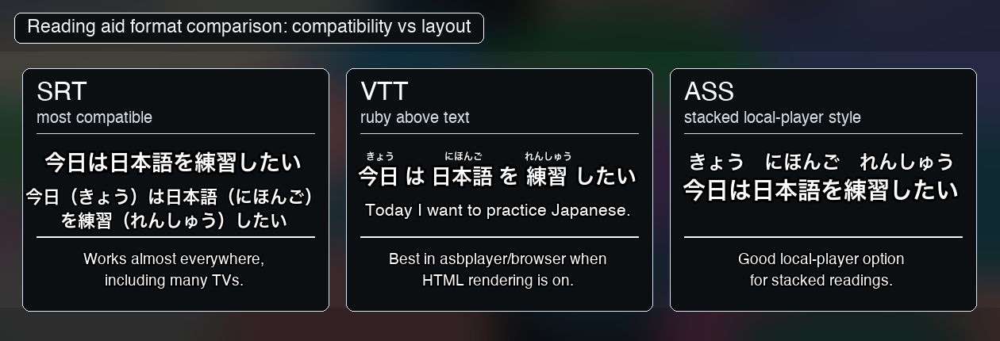

# Reading Aids And Formats

Reading aids are phonetic guides and learner support rows for the original
script. They help you connect sound, writing, and meaning while watching.

## Supported Reading Aids

| Language | Modes | Install |
|---|---|---|
| Japanese (`ja`) | `hiragana`, `katakana`, `romaji` | `pip install -e ".[furigana]"` |
| Korean (`ko`) | `revised`, `yale` | `pip install -e ".[romanization-ko]"` |
| Mandarin (`zh`) | `marks`, `numbers`, `letters` | `pip install -e ".[romanization-zh]"` |
| Cantonese (`yue`) | `numbers` | `pip install -e ".[romanization-yue]"` |
| Thai / Arabic / Hindi / Russian | Royal Thai / ALA-LC / IAST / ISO-9 | Wired through; backends land per ROADMAP |

Chinese subtitles are treated as written text (`zh`). They may be Simplified or
Traditional: `zh-Hans`, `zh-Hant`, `zh-CN`, `zh-TW`, `chs`, and `cht` all scan as
Chinese source files. Reading aids then choose the pronunciation system:

- `zh:marks`, `zh:numbers`, `zh:letters` = Mandarin pinyin.
- `yue:numbers` = Cantonese Jyutping. The wizard searches Chinese subtitles
  (`zh`) first, then derives the Jyutping row from that text.

## Format Recommendations

| Use case | Format | Notes |
|---|---|---|
| Japanese hiragana/katakana readings above kanji in asbplayer/browser | `vtt` | Enable asbplayer `Subtitle HTML = Render` for positioned readings. |
| Japanese full-sentence romaji | `vtt`, `srt`, or `ass` | Normal subtitle-size row, not tiny above-kanji text. |
| Korean romanization above Hangul | `ass` | Most reliable in VLC, mpv, and IINA. |
| Mandarin pinyin or Cantonese jyutping | `ass` | ASS handles readings above characters best. |
| Maximum player compatibility without positioned readings | `srt` | Parenthetical form works almost everywhere. |

VTT can place Japanese readings above kanji, but player support is uneven.
VLC tends to flatten those readings. For local playback of reading aids, use
ASS. For asbplayer/browser study, use VTT.



## CLI Usage

```sh
--reading ja:hiragana,ko:revised,zh:marks,yue:numbers
```

Or in a workflow/settings file:

```toml
[modify]
reading = "ja:hiragana,ko:revised,zh:marks,yue:numbers"
```

## Multi-Variant Merge

Stack the original alongside its reading-aid variants:

```sh
getsubtitle merge FOLDER -l ja,ja-hiragana,en
getsubtitle merge FOLDER -l ja,ja-hiragana,ja-romaji,en
getsubtitle merge FOLDER -l ko,ko-revised,en
getsubtitle merge FOLDER -l zh,zh-marks,en
getsubtitle merge FOLDER -l yue-numbers,zh,en
```

Output filenames collapse same-base tokens, so you get:

```text
Show.S01E01.ja-hiragana-romaji-en.srt
```

Not:

```text
ja-ja-hiragana-ja-romaji-en
```

Generate variants and stack them in one call:

```sh
getsubtitle "URL" \
    --modify --reading ja:hiragana,ja:romaji \
    --merge -l ja,ja-hiragana,ja-romaji,en
```

Add `--label-langs` to prefix each language line with `[JA]`, `[KO]`, and so on:

```sh
getsubtitle merge FOLDER -l ja,en --label-langs
```

Merged outputs include a short GetSubtitle credit/disclaimer subtitle line at the
beginning and end. Use `--no-watermark` or `[merge] watermark = false` to omit
it for private or test files.
